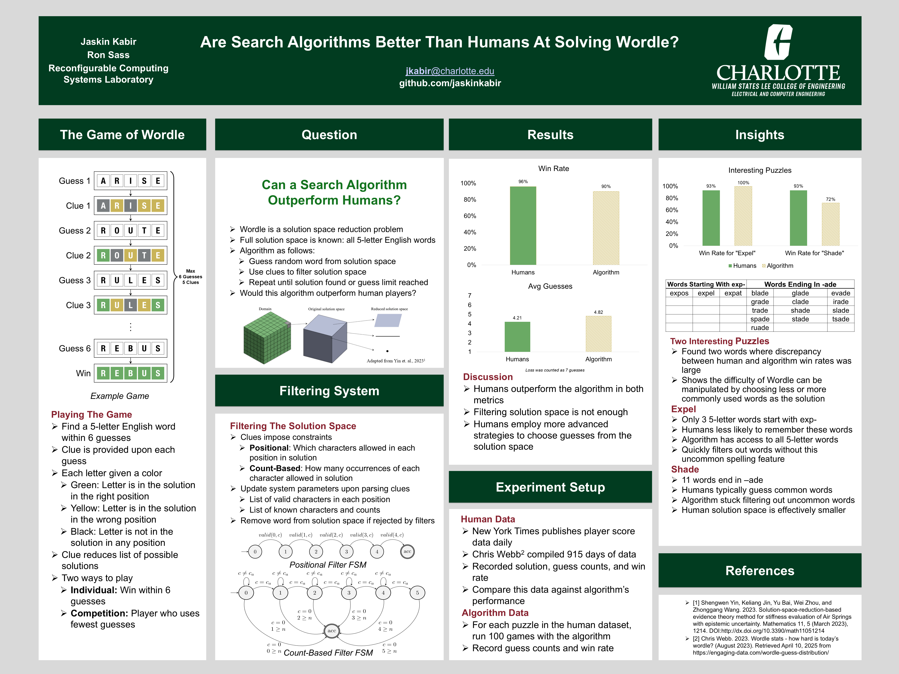

# Wordle Automata
This is an implementation of a Wordle solver using finite state automata that are reconfigurable at runtime. It is an improvement of a previous [project](https://github.com/jaskinkabir/Regex-Wordle-Solver) that used a regex-based approach to filter the solution space. This project uses a more efficient approach using finite state automata. The dynamically reconfigurable transitions eliminate the need to recompile the regex after each guess.

# Poster

The above poster was presented at the 2025 Graduate Resarch Symposium at the University of North Carolina at Charlotte and won best engineering poster.
